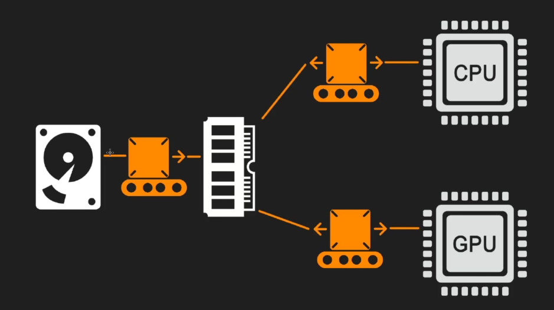
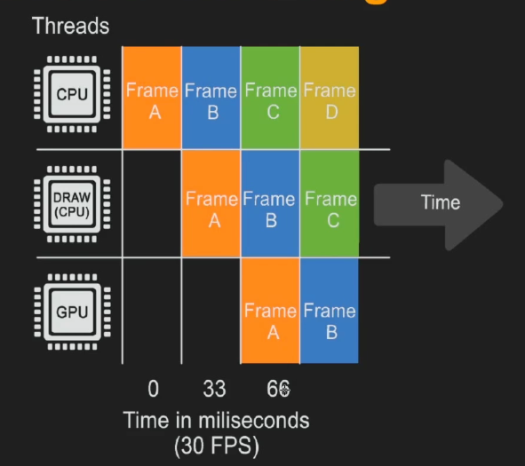

# Intro

> RTR is at its most efficient when there is nothing and you cannot do RTR perfect.

- tips 1 — based some numbers

  固定流程、纹理等必须有特定的规则等，因为这些限制可以帮助我们构建其他东西时能get benefit from these numbers。

<!--more-->

- tips 2 — managing loss

  要设置一个target framerate(性能在此时趋于稳定)，要懂得在得失中权衡—性能、质量、功能。在RTR中，并非所有内容都是即时渲染，通常采用mix of RT and Pre 

- 实时渲染时硬件发生了什么

如图所示，在渲染时，数据从硬盘经由带宽(将信息从架构中得一部分传输到另一部分)传输给内存，然后数据就会在cpu和gpu之间传输，值得注意的是，数据传输在二者之间是同步的，这意味着二者之间的性能会相互约束。

- Deferred & Forward

  - Deferred

    延时渲染，着色和光照被推迟了，先进行了几何体的渲染，在deferred pass进行光照着色，最后与前面的几何做blending。这种渲染方式被广泛用于大型游戏、引擎中，原因在于其能提供更好的性能，在进行引擎中features的开关时更加灵活，更擅长动态光照。但是，由于先进行了几何体的渲染，后期在处理其他着色时就无法利用几何体渲染时的信息了。

  - Forward

    前向渲染的几何和着色等是在一个pass中发生的。它也更擅长处理半透明表面的渲染，但是它不擅长处理多种feature blending的情况。过去在前向渲染里动态光照会有很大的性能开销，现在已经得到改善。但是由于前向渲染本身不适合处理复杂的情况，通常适用于vr、移动应用等。使用前向渲染也能够使用msaa，也就是能得到更好的抗锯齿效果。

# Before Rendering

图中得知，我们必须先在cpu进行处理，然后draw，最后GPU处理。这意味着渲染开始执行时第一帧并不会在第一时间显示出来，必须等待cpu、draw、gpu处理完后才能渲染，这也就是我们不可避免地会有延时现象。

- Calculate logic and transforms(time 0)

  在开始渲染之前，我们必须通过物理计算等方式得到位置相关的信息。得到这些位置信息显然还不够，我们需要知道哪些包含在渲染场景中。

- Occlusion Process(time 33)

  遮挡处理是为了构建一个可见物体的列表。遮挡处理一般分为四个阶段

  - 距离剔除

    超过规定的距离就不渲染

  - 视锥剔除

    摄像机一般都为锥形的，在视锥以外的都不渲染

  - 预计算可见性

    想象一个场景，这个场景被很多cell包含，每个cell记录了当前位置哪些被渲染，哪些不被渲染。

  - 遮挡剔除

    最消耗性能的部分，这里进行的是最精细的遮挡剔除。

  ### balance

  最常见的处理手段是通过合并物体来减少遮挡的计算，但是这会造成某方面渲染的内容增多。比方说一个大的寺庙，我们如果合并了这个寺庙，那么即使我们只是看到了寺庙的一小部分，引擎也会将整个寺庙渲染出来，因为遮挡处理是per object的。
