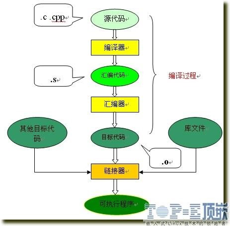

## 简单过程

<!--more-->

## 编译过程

1、编译

编译预处理：对#开头的指令和特殊符号进行处理

1) 宏定义指令，如#define INTEGER int，# undef等。

对于前一个伪指令，预编译所要做的是将程序中的所有INTEGER用int替换，但作为字符串常量的 INTEGER则不被替换。对于后者，则将取消对某个宏的定义，使以后该串的出现不再被替换。

2) 条件编译指令，如# ifdef，# ifndef，# else，# elif，# endif等。

这些伪指令的引入使得程序员可以通过定义不同的宏来决定编译程序对哪些代码进行处理。预编译程序将根据有关的文件，将那些不必要的代码过滤掉

3) 头文件包含指令，如# include "FileName" 或者# include < FileName> 等。

在头文件中一般用伪指令# define定义了大量的宏（最常见的是字符常量），同时包含有各种外部符号的声明。采用头文件的目的主要是为了使某些定义可以供多个不同的C源程序使用。因为在需要用到这些定义的C源程序中，只需加上一条# include语句即可，而不必再在此文件中将这些定义重复一遍。预编译程序将把头文件中的定义统统都加入到它所产生的输出文件中，以供编译程序对之进行处理。包含到c源程序中的头文件可以是系统提供的，这些头文件一般被放在/ usr/ include目录下。在程序中# include它们要使用尖括号（< >）。另外开发人员也可以定义自己的头文件，这些文件一般与c源程序放在同一目录下，此时在# include中要用双引号（""）。

4) 特殊符号，预编译程序可以识别一些特殊的符号。

例如在源程序中出现的LINE标识将被解释为当前行号（十进制数），FILE则被解释为当前被编译的C源程序的名称。预编译程序对于在源程序中出现的这些串将用合适的值进行替换。

预编译程序所完成的基本上是对源程序的“替代”工作。经过此种替代，生成一个没有宏定义、没有条件编译指令、没有特殊符号的输出文件。这个文件的含义同没有经过预处理的源文件是相同的，但内容有所不同。下一步，此输出文件将作为编译程序的输入而被翻译成为机器指令。

编译优化阶段：编译程序所要作得工作就是通过词法分析和语法分析，在确认所有的指令都符合语法规则之后，将其翻译成等价的中间代码表示或汇编代码。优化一部分是对中间代码的优化。这种优化不依赖于具体的计算机。另一种优化则主要针对目标代码的生成而进行的。

2、汇编

汇编过程实际上指把汇编语言代码翻译成目标机器指令的过程。对于被翻译系统处理的每一个C语言源程序，都将最终经过这一处理而得到相应的目标文件。目标文件中所存放的也就是与源程序等效的目标的机器语言代码。目标文件由段组成。通常一个目标文件中至少有两个段：

1) 代码段：该段中所包含的主要是程序的指令。该段一般是可读和可执行的，但一般却不可写。

2) 数据段：主要存放程序中要用到的各种全局变量或静态的数据。一般数据段都是可读，可写，可执行的。

3、链接

由汇编程序生成的目标文件并不能立即就被执行，其中可能还有许多没有解决的问题。

例如，某个源文件中的函数可能引用了另一个源文件中定义的某个符号（如变量或者函数调用等）；在程序中可能调用了某个库文件中的函数，等等。所有的这些问题，都需要经链接程序的处理方能得以解决。链接程序的主要工作就是将有关的目标文件彼此相连接，也即将在一个文件中引用的符号同该符号在另外一个文件中的定义连接起来，使得所有的这些目标文件成为一个能够被操作系统装入执行的统一整体。根据开发人员指定的同库函数的链接方式的不同，链接处理可分为两种：

1) 静态链接

在这种链接方式下，函数的代码将从其所在的静态链接库中被拷贝到最终的可执行程序中。这样该程序在被执行时这些代码将被装入到该进程的虚拟地址空间中。静态链接库实际上是一个目标文件的集合，其中的每个文件含有库中的一个或者一组相关函数的代码。

2) 动态链接

在此种方式下，函数的代码被放到称作是动态链接库或共享对象的某个目标文件中。链接程序此时所作的只是在最终的可执行程序中记录下共享对象的名字以及其它少量的登记信息。在此可执行文件被执行时，动态链接库的全部内容将被映射到运行时相应进程的虚地址空间。动态链接程序将根据可执行程序中记录的信息找到相应的函数代码。

对于可执行文件中的函数调用，可分别采用动态链接或静态链接的方法。使用动态链接能够使最终的可执行文件比较短小，并且当共享对象被多个进程使用时能节约一些内存，因为在内存中只需要保存一份此共享对象的代码。但并不是使用动态链接就一定比使用静态链接要优越。在某些情况下动态链接可能带来一些性能上损害。

摘自：https://www.cnblogs.com/mickole/articles/3659112.html
